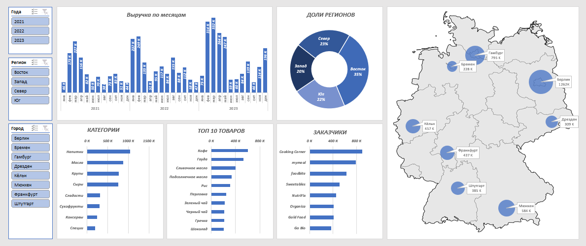
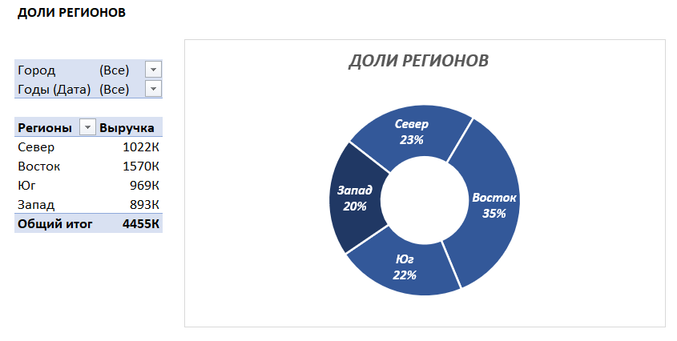
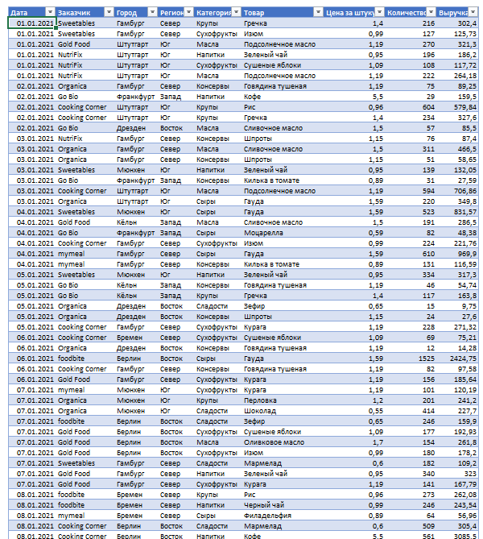

# Dashboard Germany 

</

This dashboard is made in **Excel** with the help of **pivot tables**. The data is taken from the internet for 8 cities in Germany. The dashboard presents data: **revenue by month, shares of regions, categories, top 10 products, customers**. There are also slices by **year, region and city**.

</

Each chart is on a **separate pivot table and on a separate sheet** . This is for convenience and for quick changes to the dashboard.

</

Also, the table is **dynamic** . This means that when new data is added to it, the dashboard itself also changes 

It's worth noting that the data was without any garbage. Otherwise, it would have been worthwhile to **clean** the data  

